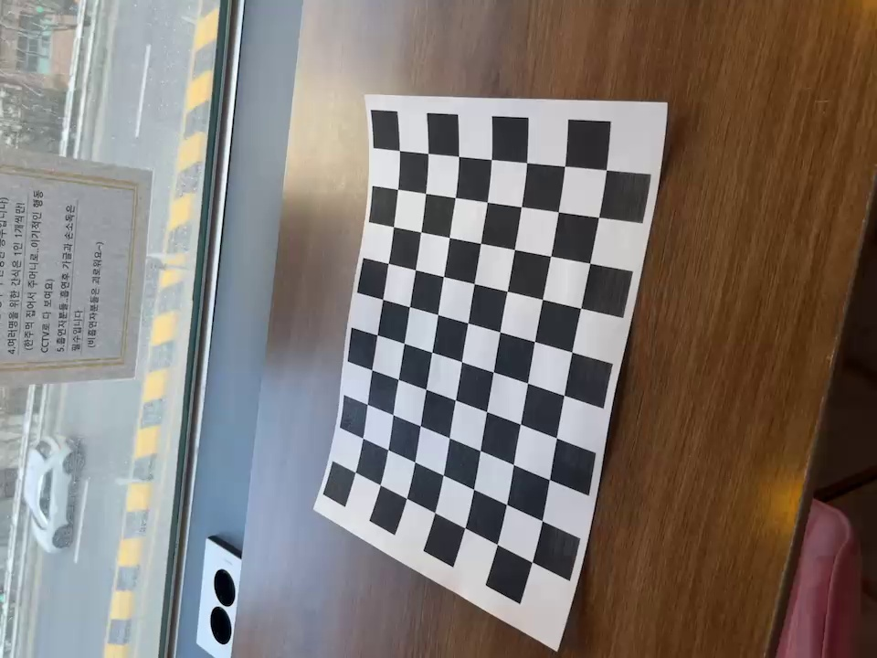
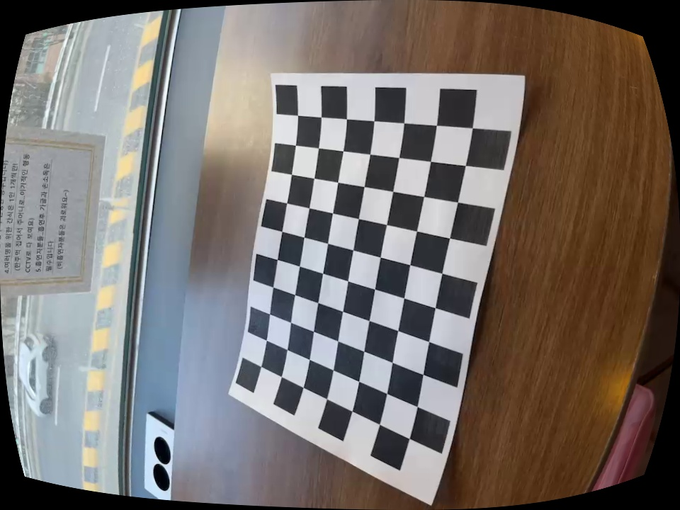

# Camera-Calibration
- introduce
The program utilizes OpenCV to implement camera calibration and distortion correction. It can analyze images with checkboard patterns to calculate the camera's internal parameters and distortion coefficients, and correct distortion

##  program code 기능
- OpenCV를 활용하여 **카메라 캘리브레이션**과 **왜곡 보정(Undistortion)** 을 수행합니다.  
입력 영상으로부터 체크보드 패턴을 감지하고, 이를 기반으로 내부 파라미터를 계산하여 영상의 왜곡을 제거합니다.

---

### 사용한 데이터 

- **핸드폰으로 찍은 체크보드 영상**: `checkboard2.mp4`  
- **체크보드 패턴의 정보** : 11x8 칸 → 내부 코너 수 (10, 7)  

---

###  Step 1. Camera Calibration

- 다양한 각도에서 촬영한 체스보드 프레임들에서 내부 코너점 검출
- `cv2.calibrateCamera()`를 통해 내 카메라의 **내부 파라미터 행렬**, **왜곡 계수** 등을 추정
  
#### 1-1. 체스보드 코너 검출

- 입력 영상 프레임을 순차적으로 읽으며, 매 **5프레임마다** 체스보드 코너를 탐지 (`cv2.findChessboardCorners`)
- 검출 성공 시:
  - 실제 체스보드의 3D 좌표 (`objpoints`)
  - 이미지 상의 2D 코너 좌표 (`imgpoints`)를 저장
  - 코너 정밀도 향상을 위해 `cv2.cornerSubPix` 사용

#### 1-2. 내부 파라미터 추정

- `cv2.calibrateCamera()` 호출:
  - **Camera Matrix (`mtx`)**
  - **Distortion Coefficients (`dist`)**
  - **회전 벡터 (`rvecs`)**
  - **이동 벡터 (`tvecs`)**

#### 1-3. 재투영 오차 (RMSE) 계산

- `cv2.projectPoints()`를 통해 예측된 코너 위치와 실제 이미지상의 코너 위치 비교
- 평균 재투영 오차(RMSE) 출력 → 보정 정확도 판단

#### 1-4. 결과 저장

- 카메라 파라미터는 `calibration_result.npz`에 저장

#  Calibration 결과 
## 1. Camera Matrix (내부 파라미터)

| 파라미터 | 설명 | 값 |
|----------|------|-----|
| fx       | 초점 거리 (x 방향) | 819.1333 |
| fy       | 초점 거리 (y 방향) | 787.4159 |
| cx       | 주점의 x 좌표      | 459.2465 |
| cy       | 주점의 y 좌표      | 363.4292 |

---

- 이후 `cv2.undistort()` 수행
- **렌즈의 왜곡을 제거한 보정 영상**을 생성
  
## 2. Distortion Coefficients (왜곡 계수)

#### 2-1. 보정용 카메라 행렬 생성

- `cv2.getOptimalNewCameraMatrix()` 사용
  - 입력 영상 크기 및 왜곡 계수를 기반으로 보정된 카메라 행렬 생성

#### 2-2. 프레임 왜곡 제거

- 영상의 각 프레임에 대해 `cv2.undistort()` 사용
- 보정된 결과를 `undistorted_output.avi`에 저장
- 첫 번째 프레임은 비교용 이미지로 저장
  - `original_frame.jpg` (보정 전)
  - `undistorted_frame.jpg` (보정 후)

| 계수 | 의미 | 값 |
|------|------|------|
| k1   | 방사 왜곡 계수 1차 | 0.3517 |
| k2   | 방사 왜곡 계수 2차 | -2.1881 |
| p1   | 접선 왜곡 계수 1차 | 0.00095 |
| p2   | 접선 왜곡 계수 2차 | -0.0474 |
| k3   | 방사 왜곡 계수 3차 | 6.3331 |

---

## 3. RMSE (Root Mean Square Error)

- **정확도 지표로, 작을수록 보정이 잘된 것**

- ### RMSE  :  0.10401189718603736  
---

## 4. 생성된 파일

| 파일명 | 설명 |
|--------|------|
| `calibration_result.npz` | Camera Matrix 및 Distortion Coefficients 저장 |
| `undistorted_output.avi` | 왜곡 보정된 결과 영상 |
| `original_frame.jpg` | 원본 첫 프레임 이미지 |
| `undistorted_frame.jpg` | 보정된 첫 프레임 이미지 |

---

###  핵심 코드 구조

- `camera_calibration.py`: 체크보드 인식 및 카메라 보정 수행
- OpenCV 함수:
  - `cv2.findChessboardCorners()`
  - `cv2.calibrateCamera()`
  - `cv2.undistort()` : 왜곡 보정

---

###  extra info

- 동영상은 약 369 프레임
- 총 74개의 프레임에서 체크보드 검출 성공

---

## 동영상
#### before

https://github.com/user-attachments/assets/b4c7ad92-c350-4654-b8ef-56533b6cef72

#### after

https://github.com/user-attachments/assets/f759f41f-42ce-46e6-8c3f-1146ef27d1f4

--- 
#### 이미지로 전 후 비교 
  
  

---
import numpy as np

data = np.load('calibration_result.npz')
print("Camera Matrix:\n", data['mtx'])
print("Distortion Coefficients:\n", data['dist'])

- 위의 코드를 통해 .npz 파일을 열어 calibration 결과 확인함
---

